# The Silent Echo

## Page 1
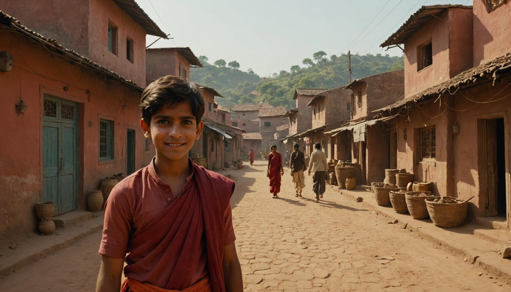
**Audio:** [Listen](audio/page_01.mp3)

> In a small Indian village, Aarav watches his sister, Priya, prepare for her wedding. The air is filled with joy and anticipation.

---

## Page 2
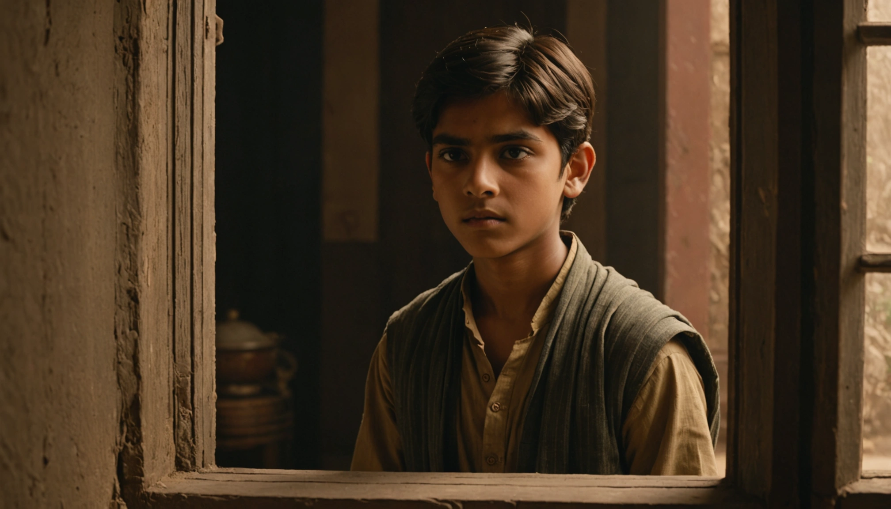
**Audio:** [Listen](audio/page_02.mp3)

> After the wedding, Priya moves to her new home. Aarav notices her smile fading as demands for dowry begin.

---

## Page 3
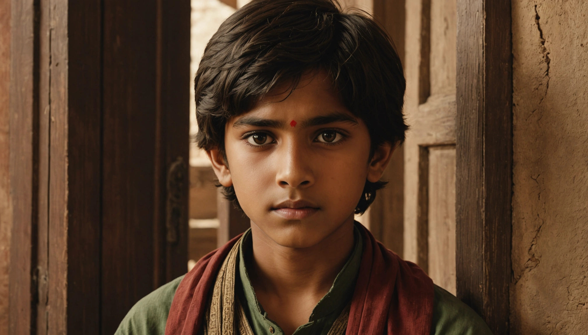
**Audio:** [Listen](audio/page_03.mp3)

> Aarav hears shouts from next door. He sees Priya's husband yelling, and she flinches. The tension in the house grows.

---

## Page 4
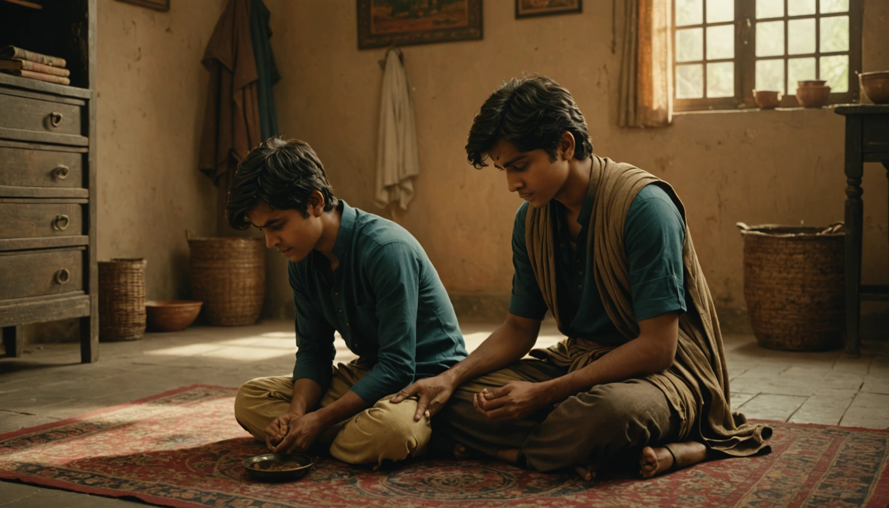
**Audio:** [Listen](audio/page_04.mp3)

> One day, Aarav finds Priya crying silently. She whispers about the violence and the pressure for more dowry.

---

## Page 5
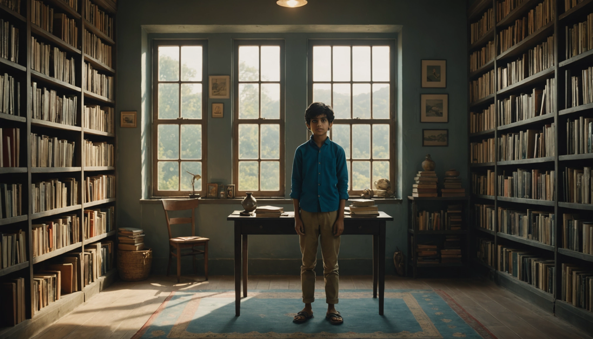
**Audio:** [Listen](audio/page_05.mp3)

> Aarav decides to learn more. He visits the village library, searching for books on women's rights and laws.

---

## Page 6
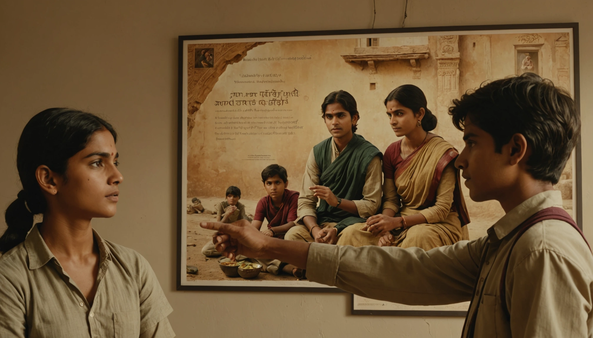
**Audio:** [Listen](audio/page_06.mp3)

> He discovers information about anti-dowry laws and support groups. A poster catches his eye: a local women's group meets weekly.

---

## Page 7
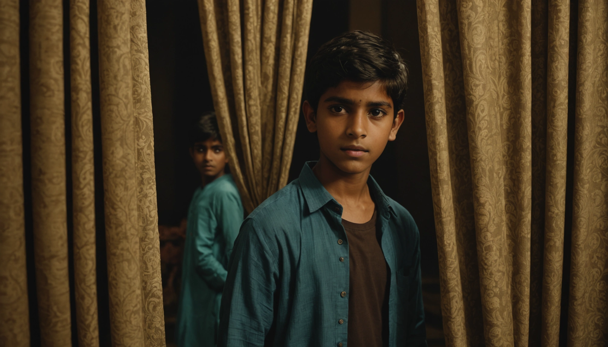
**Audio:** [Listen](audio/page_07.mp3)

> Aarav attends the meeting secretly. He listens as women share stories of strength and legal victories against dowry demands.

---

## Page 8
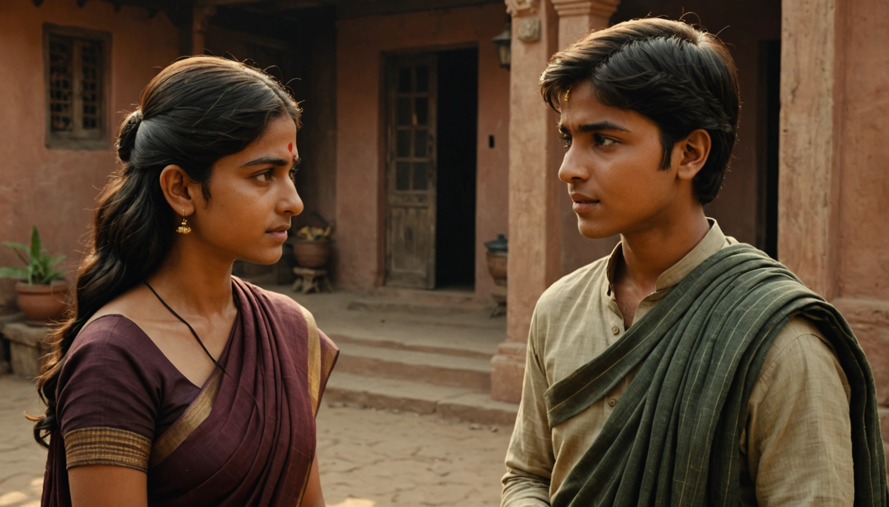
**Audio:** [Listen](audio/page_08.mp3)

> He gathers courage and approaches the group leader, Meera. She explains how to file a complaint and seek protection for Priya.

---

## Page 9
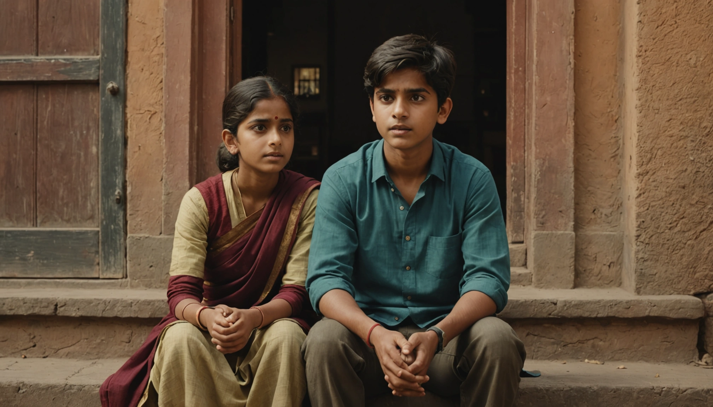
**Audio:** [Listen](audio/page_09.mp3)

> Aarav returns home and tells Priya about the plan. At first, she is afraid, but he reassures her with the knowledge he gained.

---

## Page 10
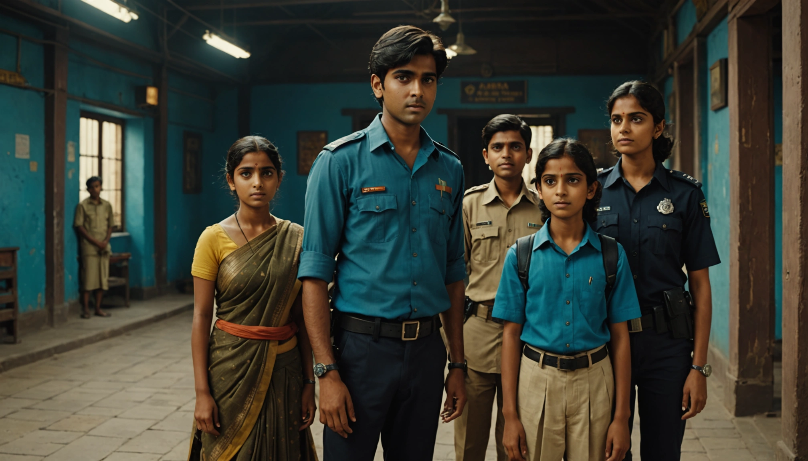
**Audio:** [Listen](audio/page_10.mp3)

> Together, they visit the local police station with Meera. Aarav speaks up, detailing the abuse and dowry demands.

---

## Page 11
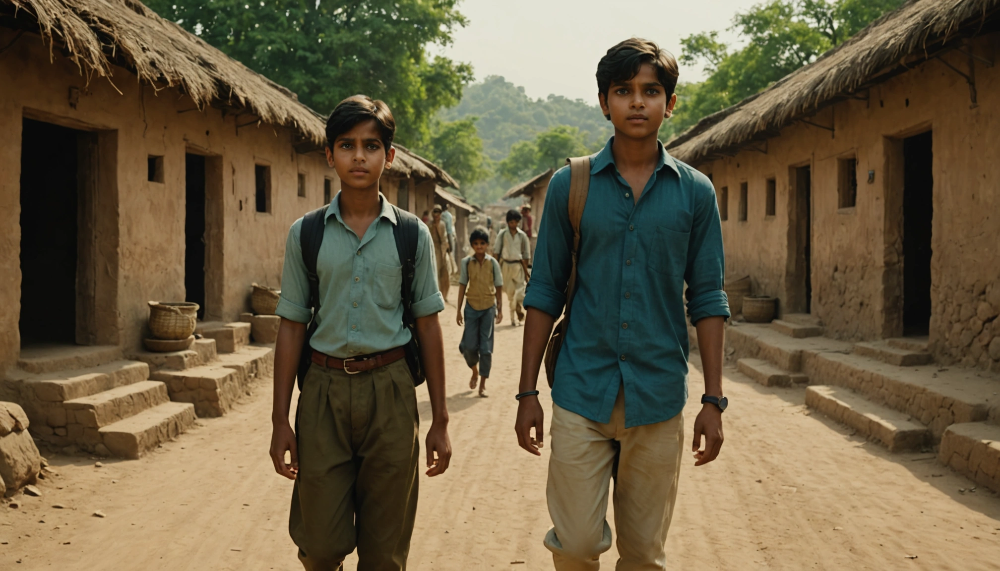
**Audio:** [Listen](audio/page_11.mp3)

> The authorities take action. Priya's husband is warned, and support is arranged. The village begins to talk, spreading awareness.

---

## Page 12
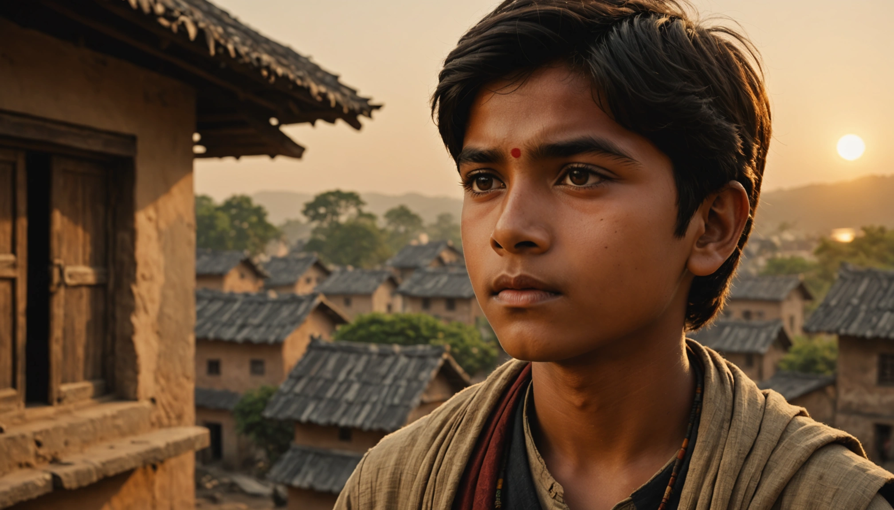
**Audio:** [Listen](audio/page_12.mp3)

> Aarav stands tall, knowing his voice made a difference. He vows to continue speaking out, empowering his family and community against injustice.

---

